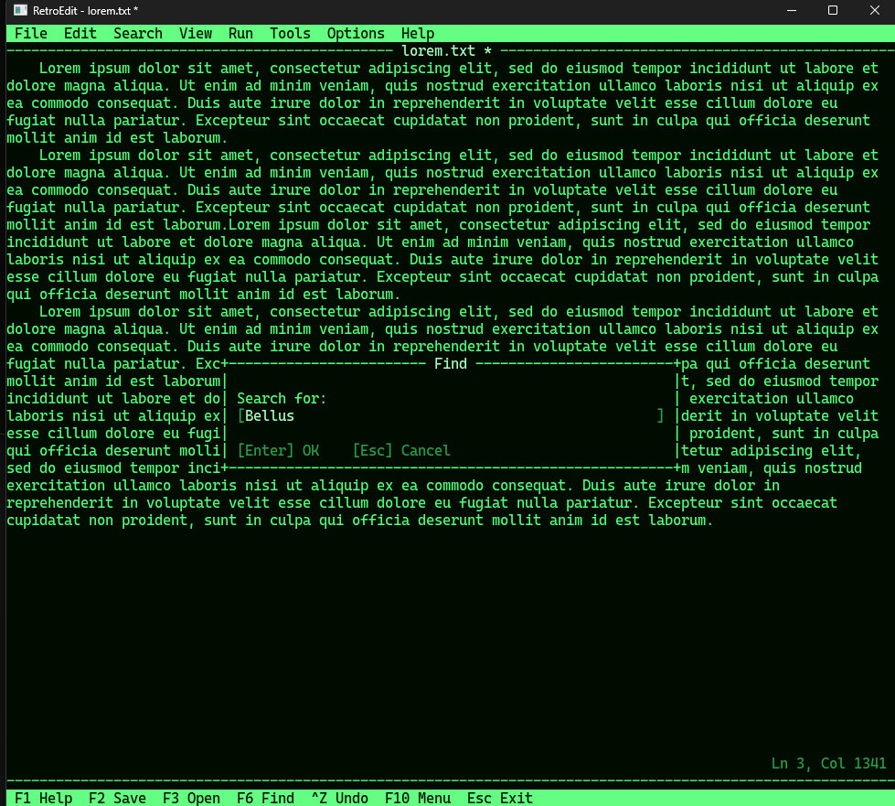

# RetroEdit

A cross-platform desktop text editor styled after the green-phosphor monochrome terminals of the early 1980s. Modern code, modern dependencies — early-1980s interaction style.



RetroEdit draws its own text-mode interface inside an SDL window: a character-cell virtual screen, a drawn-in-software menu bar and status bar, a function-key command bar, and modal dialogs that live entirely inside the grid. No native OS menus, no native file dialogs, no toolbar icons.

## Status

Early but usable. The editor opens, edits, and saves plain-text files; supports selection, cut/copy/paste, undo/redo, and find; navigates menus by keyboard; and lets you pick from several bundled monospace fonts at runtime. Themes are still compiled in (green phosphor), and there is no command palette / scripting yet — see the roadmap below.

Per-file settings (currently word-wrap) are persisted in a sidecar `<file>.retroedit` next to the document and re-applied on open. The format is plain `key=value` text and is extensible — new settings are added with one line each in the capture/apply helpers.

The main loop is event-driven with vsync and a redraw-on-demand dirty flag, so the editor idles at roughly 1% CPU and 1% GPU on a Windows x64 desktop even with a screen full of text — see [Render Loop and Idle Cost](Docs/RetroEdit.md#render-loop-and-idle-cost) in the design doc.

Primary target is **Windows x64**. The architecture is portable; Linux and macOS builds are planned but not yet validated.

## Features

- Character-cell virtual screen rendered via SDL3 / SDL3_ttf
- Green monochrome theme with bright / dim / reverse-video attributes
- Menu bar with Alt-key mnemonics, dropdowns, and keyboard navigation
- Function-key bar (F1 Help, F2 Save, F3 Open, F5 Run, F10 Menu, Esc Exit)
- Modal dialogs: Open, Save As, Find, exit/new-file confirmation, Help, About, Font, Word-Wrap
- Selection, cut, copy, paste
- Undo / redo
- Find (forward, wrap-around)
- Word-wrap toggle (display-only soft wrap)
- Runtime-selectable font face and size — Cascadia Mono, IBM Plex Mono, JetBrains Mono, VT323
- Opens a file from the command line: `RetroEdit.exe path\to\file.txt`

## Keyboard shortcuts

| Key       | Action                       |
|-----------|------------------------------|
| F1        | Help                         |
| F2        | Save                         |
| F3        | Open                         |
| F6        | Find next                    |
| F10       | Activate menu bar            |
| Esc       | Cancel dialog / menu / exit  |
| Alt+F/E/S/V/R/T/O/H | Open File / Edit / Search / View / Run / Tools / Options / Help menu |
| Ctrl+N    | New file                     |
| Ctrl+O    | Open                         |
| Ctrl+S    | Save                         |
| Ctrl+Shift+S | Save As                   |
| Ctrl+F    | Find                         |
| Ctrl+A    | Select all                   |
| Ctrl+X / C / V | Cut / Copy / Paste      |
| Ctrl+Z / Y | Undo / Redo                 |

## Building

Requires CMake 3.24+ and Visual Studio 2022 (MSVC). SDL3 and SDL3_ttf are vendored in the repo — no external package installs needed.

```powershell
cmake -S . -B build -G "Visual Studio 17 2022" -A x64
cmake --build build --config Debug
.\build\Debug\RetroEdit.exe
```

For a release build:

```powershell
cmake --build build --config Release
.\build\Release\RetroEdit.exe
```

The build copies `SDL3.dll`, `SDL3_ttf.dll`, and the `assets/` directory next to the executable, so it runs in place.

## Project layout

```
src/
  main.cpp        entry point
  app/            Application orchestrator
  platform/       SDL window + asset path
  render/         ScreenBuffer, RetroRenderer, GlyphCache, Theme
  editor/         TextBuffer, FileDocument, Selection, UndoHistory (SDL-free)
  ui/             RetroUi (menus, dialogs, status bar), MenuDefs
assets/
  fonts/          Bundled monospace TTFs
  themes/         (reserved; themes are currently compiled in)
Docs/
  RetroEdit.md    Full design document
SDL/              Vendored SDL3 source
SDL_ttf/          Vendored SDL3_ttf prebuilt binaries
```

The editor core (`src/editor/`) has no SDL dependency, so it remains testable without a graphics context.

## Roadmap

The full staged plan is in [Docs/RetroEdit.md](Docs/RetroEdit.md). At a glance:

| Stage | Goal                                                              | State        |
|-------|-------------------------------------------------------------------|--------------|
| 1     | SDL window, virtual screen, menu/status/cursor                    | Done         |
| 2     | Type, navigate, open/save files                                   | Done         |
| 3     | Selection, cut/copy/paste, undo/redo, find                        | Done         |
| 4     | Alt-key menus, function-key bar, modal dialogs                    | Done         |
| 5     | Command registry, rebindable keys, theme files, settings file     | Partial      |
| 6     | Syntax highlighting, build/run, output panel, error navigation    | Planned      |
| 7     | Optional local AI helper (llama.cpp / Ollama)                     | Planned      |

## Design principles

- **Keyboard-first.** Mouse is a convenience, not a requirement.
- **Draw everything ourselves.** No native menus, no native dialogs — the retro feel comes from owning every pixel inside the window.
- **Model/View separation.** The text buffer doesn't know how it's drawn; the renderer doesn't know what the text means.
- **Theme-driven color.** Every color goes through the active theme. No hardcoded RGB outside theme definitions.
- **Idle cheaply.** The main loop blocks in `SDL_WaitEventTimeout` until either an event arrives or the next cursor-blink tick. Vsync caps the maximum frame rate; a dirty flag skips rendering when nothing visible has changed. A GUI at rest should do nothing.

## License

MIT — see [LICENSE](LICENSE).

Bundled fonts ship under the SIL Open Font License (see `assets/fonts/OFL-*.txt`). Vendored SDL3 and SDL3_ttf are under the Zlib license.
